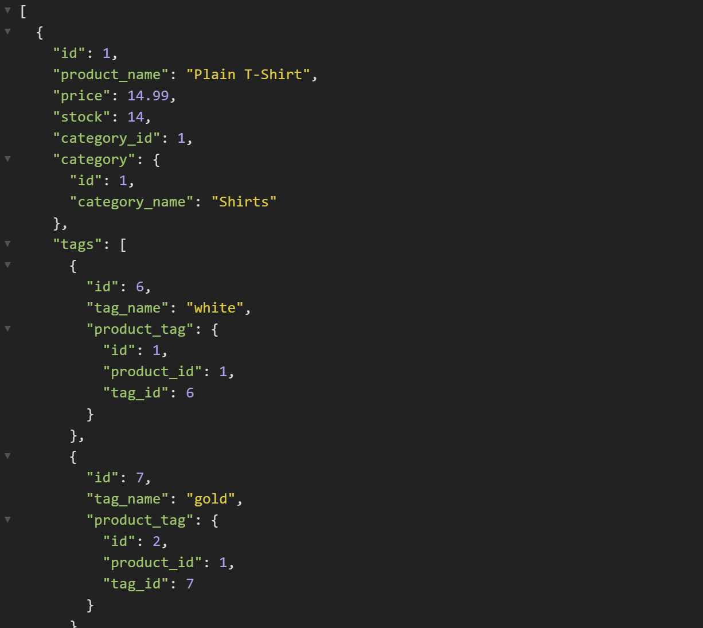

# ORM-Commerce-Engine
UofU-VIRT-FSF-PT-07-2022-U-LOLC-MWTH Module 13 Object-Relational Mapping (ORM): E-Commerce Back End

## Description

The ORM Commerce Enigine is a back-end product data solution for an e-Commerce site. It provides API routs for products, tags, and categories. This solution provides the flexibility to allow an admin to get all products, tags, or categories; get a single item; or perform CRUD operations on a product, tag, or category.

## Mock-Up



See the ORM Commerce Engine run!

[Demo video of all the ORM Commerce Engine functions](https://drive.google.com/file/d/1W42uAb31LjN7esqW_eU8O7ZNrdKBHDWN/view?usp=sharing)

## Project Requirements

### User Story

```md
AS A manager at an internet retail company
I WANT a back end for my e-commerce website that uses the latest technologies
SO THAT my company can compete with other e-commerce companies
```

### Acceptance Criteria

```md
GIVEN a functional Express.js API
WHEN I add my database name, MySQL username, and MySQL password to an environment variable file
THEN I am able to connect to a database using Sequelize
WHEN I enter schema and seed commands
THEN a development database is created and is seeded with test data
WHEN I enter the command to invoke the application
THEN my server is started and the Sequelize models are synced to the MySQL database
WHEN I open API GET routes in Insomnia for categories, products, or tags
THEN the data for each of these routes is displayed in a formatted JSON
WHEN I test API POST, PUT, and DELETE routes in Insomnia
THEN I am able to successfully create, update, and delete data in my database
```